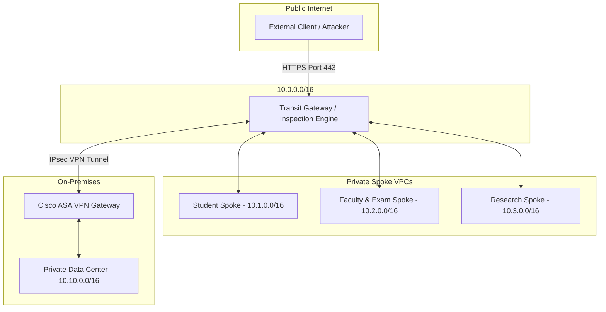

# Cisco Cyber Track 2026: Hybrid Data Center Zero-Trust Portal

This repository contains the production-ready simulation portal and infrastructure-as-code (IaC) templates for the **Cisco Cyber Track Virtual Internship**. The project demonstrates a Zero-Trust Hybrid Data Center architecture designed to enforce micro-segmentation, eliminate transitive routing risks, and secure data tunnels between cloud resources and on-premises environments.

---

## 🏗️ Architecture Overview

The system models a secure **Hub-and-Spoke** network layout to partition student services, faculty resources, and research environments:



### Key Security Guardrails Implemented
1. **No Transitive Spoke Peering**: Spokes peer directly with the central **Transit Hub VPC**. Spoke-to-Spoke routing is strictly disabled at the route table level.
2. **Kubernetes Namespace Separation**: Pod communications are locked down using `default-deny-all` `NetworkPolicies`. Outbound container flows are restricted to the local database and verified DNS endpoints only.
3. **Cisco ASA IPsec VPN**: Secure cross-site connections utilize IKEv2 policies configured with AES-256 encryption and SHA-256 hashing.
4. **Least-Privilege Workload Access**: Workloads utilize IAM Workload Identity bindings to read/write only from designated resources, completely blocking wildcard administrative actions.

---

## ⚡ Threat Simulation Harness (PRD Section 14)

The built-in web simulator allows you to execute a threat validation scenario modeled after a compromised container instance inside the **Research Spoke VPC (10.3.0.0/16)**:

- **Lateral Threat Vector**: A compromised SSH key triggers scan requests aimed at the Student and Faculty networks.
- **Firewall Blocking**: Cisco Secure Firewall rules drop packet flows transitioning between spoke boundaries.
- **Micro-segmentation Containment**: Container egress validation blocks traffic seeking access to foreign namespaces.
- **Verification Result**: The blast radius is confined to 0% lateral exposure, validating the security architecture.

---

## ⚙️ Cisco Packet Tracer Validation

To configure and verify this layout in **Cisco Packet Tracer**:

1. **Download Configuration**: Generate and download the `cisco_hybrid_datacenter.pkt` template directly from the portal's action bar.
2. **Apply ASA ACL Config**:
   * Open the CLI console of the Cisco ASA 5506-X Security Gateway.
   * Apply the access control list commands found in the portal's code repository window (`cisco/cisco-asa.cfg`).
3. **Run Validation Commands**:
   * **Ping Success**: Run `ping 10.1.2.10` from the Student App terminal to verify local database connectivity.
   * **Ping Failures**: Attempt to ping across the firewall boundaries (e.g., from Research App host 10.3.1.15 to Student host 10.1.1.5). The ping packets will be dropped by the ASA ACLs.

---

## 🚀 Setup & Launch Instructions

### Prerequisites
* Node.js v18 or later
* npm / yarn

### Development Server
Install dependencies and run the server locally:

```bash
# Install packages
npm install

# Start Next.js development server
npm run dev
```

Open [http://localhost:3001](http://localhost:3001) in your browser to preview the live interactive dashboard.

### Build Production Bundle
To compile and type-check the application:

```bash
npm run build
```
